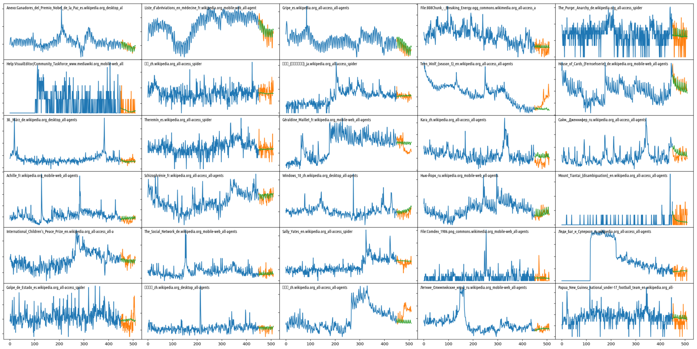

# Kaggle Web Traffic Time Series Forecasting
1st place solution

Main files:
 * `make_features.py` - builds features from source data
 * `input_pipe.py` - TF data preprocessing pipeline (assembles features
  into training/evaluation tensors, performs some sampling and normalisation)
 * `model.py` - the model
 * `trainer.py` - trains the model(s)
 * `hparams.py` - hyperpatameter sets.
 * `submission-final.ipynb` - generates predictions for submission

How to reproduce competition results:
1. Download input files from https://www.kaggle.com/c/web-traffic-time-series-forecasting/data :
`key_2.csv.zip`, `train_2.csv.zip`, put them into `data` directory.
2. Run `python make_features.py data/vars --add_days=63`. It will
extract data and features from the input files and put them into
`data/vars` as Tensorflow checkpoint.
3. Run trainer:
`python trainer.py --name s32 --hparam_set=s32 --n_models=3 --name s32 --no_eval --no_forward_split
 --asgd_decay=0.99 --max_steps=11500 --save_from_step=10500`. This command
 will simultaneously train 3 models on different seeds (on a single TF graph)
 and save 10 checkpoints from step 10500 to step 11500 to `data/cpt`.
 __Note:__ training requires GPU, because of cuDNN usage. CPU training will not work.
 If you have 3 or more GPUs, add `--multi_gpu` flag to speed up the training. One can also try different
hyperparameter sets (described in `hparams.py`): `--hparam_set=definc`,
`--hparam_set=inst81`, etc.
Don't be afraid of displayed NaN losses during training. This is normal,
because we do the training in a blind mode, without any evaluation of model performance.
4. Run `submission-final.ipynb` in a standard jupyter notebook environment,
execute all cells. Prediction will take some time, because it have to
load and evaluate 30 different model weights. At the end,
you'll get `submission.csv.gz` file in `data` directory.

See also [detailed model description](how_it_works.md)

-----------------------------------

GK modifications for own data:
1. PREPROCESS.py - Maximize reuse of existing architecture: just put my data in exact same format as Kaggle competition csv's
2. $source activate gktf
3. $cd ..../kaggle-web-traffic
4. $python3 PREPROCESS.py
5. $python3 make_features.py data/kaggle/vars kaggle --add_days=63 #need to specify the data directory (data/vars) and feature_set {kaggle, simple, full} depending on using default Arturius kaggle vs. own custom for this application
6. $python3 trainer.py --name TEST_attn_head --hparam_set=TEST_attn_head --n_models=3 --asgd_decay=0.99 --max_steps=11500 --save_from_step=10000
7. $python3 PREDICT.py

- confirmed it runs with 2 layers stacked GRU (for both encoder and decoder modules), or with attention mechanism. Performance is worse in both cases [SMAPE], at least initially.

To do:
1. finish PREPROCESS.py to do better imputation using basic forecasting method [just use STL or Theta to fill in small gaps; otherwise remove blocks]
2. modify make_features / InputPipeline / VarFeeder  etc. to NOT do the lagged autocorrelations [if ts too short], to NOT use lagged_x, to NOT use wikipedia specific features.
Use only features relevant to this data.  Still use the (tiled) median series value (before standard scaling), or few other quantiles, too. Keep day of week, add onehot encoded continent or use country like he has it.
3. Prediction intervals
4. Architecture improvements