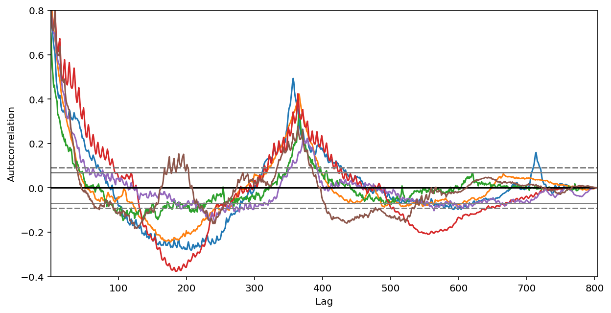
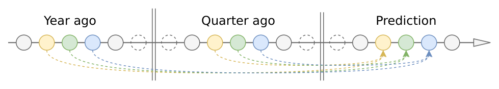
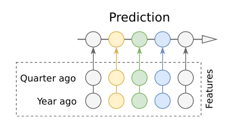
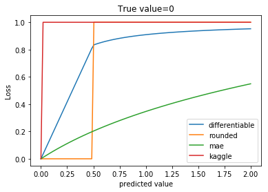
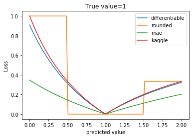
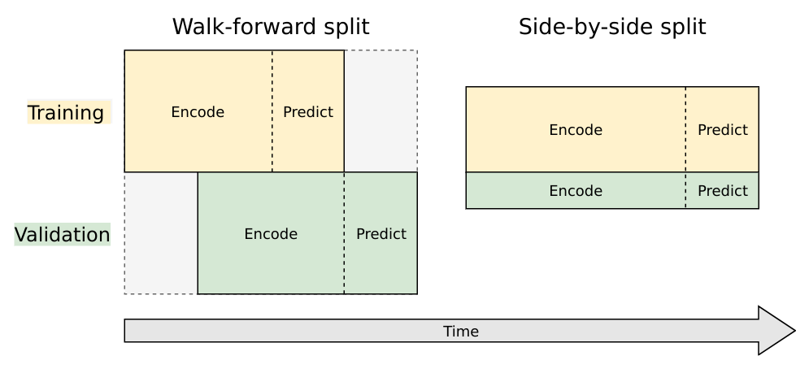
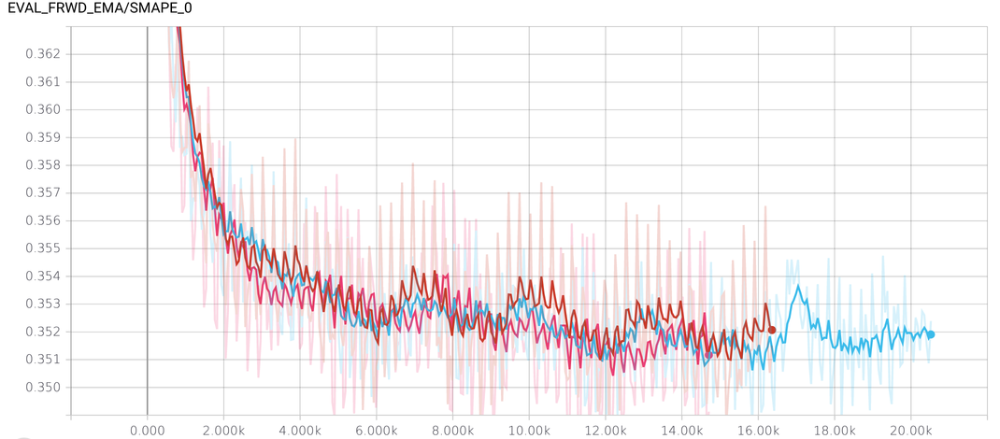

# How it works
__TL;DR__ this is seq2seq model with some additions to utilize year-to-year
and quarter-to-quarter seasonality in data.
___
There are two main information sources for prediction:
1. Local features. If we see a trend, we expect that it will continue
 (AutoRegressive model), if we see a traffic spike, it will gradually decay (Moving Average model),
 if wee see more traffic on holidays, we expect to have more traffic on
 holidays in the future (seasonal model).
2. Global features. If we look to autocorrelation plot, we'll notice strong
year-to-year autocorrelation and some quarter-to-quarter autocorrelation.



The good model should use both global and local features, combining them
in a intelligent way.

I decided to use RNN seq2seq model for prediction, because:
1. RNN can be thought as a natural extension of well-studied ARIMA models, but much more
flexible and expressive.
2. RNN is non-parametric, that's greatly simplifies learning.
Imagine working with different ARIMA parameters for 145K timeseries.
3. Any exogenous feature (numerical or categorical, time-dependent or series-dependent)
 can be easily injected into the model
4. seq2seq seems natural for this task: we predict next values, conditioning on joint
probability of previous values, including our past predictions. Use of past predictions
stabilizes the model, it learns to be conservative, because error accumulates on each step,
and extreme prediction at one step can ruin prediction quality for all subsequent steps.
5. Deep Learning is all the hype nowadays

## Feature engineering
I tried to be minimalistic, because RNN is powerful enough to discover
and learn features on its own.
Model feature list:
 * *pageviews* (spelled as 'hits' in the model code, because of my web-analytics background).
 Raw values transformed by log1p() to get more-or-less normal intra-series values distribution,
 instead of skewed one.
 * *agent*, *country*, *site* - these features are extracted from page urls and one-hot encoded
 * *day of week* - to capture weekly seasonality
 * *year-to-year autocorrelation*, *quarter-to-quarter autocorrelation* - to capture yearly and quarterly seasonality strength.
 * *page popularity* - High traffic and low traffic pages have different traffic change patterns,
 this feature (median of pageviews) helps to capture traffic scale.
 This scale information is lost in a *pageviews* feature, because each pageviews series
 independently normalized to zero mean and unit variance.
 * *lagged pageviews* - I'll describe this feature later

## Feature preprocessing
All features (including one-hot encoded) are normalized to zero mean and unit variance. Each *pageviews*
series normalized independently.

Time-independent features (autocorrelations, country, etc) are "stretched" to timeseries length
i.e. repeated for each day by `tf.tile()` command.

Model trains on random fixed-length samples from original timeseries. For example,
if original timeseries length is 600 days, and we use 200-day samples for training,
we'll have a choice of 400 days to start the sample.

This sampling works as effective data augmentation mechanism:
training code randomly chooses starting point for each timeseries on each
 step, generating endless stream of almost non-repeating data.


## Model core
Model has two main parts: encoder and decoder.


Encoder is [cuDNN GRU](https://www.tensorflow.org/versions/master/api_docs/python/tf/contrib/cudnn_rnn/CudnnGRU). cuDNN works much faster (5x-10x) than native Tensorflow RNNCells, at the cost
 of some inconvenience to use and poor documentation.

Decoder is TF `GRUBlockCell`, wrapped in `tf.while_loop()` construct. Code
inside the loop gets prediction from previous step and
 appends it to the input features for current step.

## Working with long timeseries
LSTM/GRU is a great solution for relatively short sequences, up to 100-300 items.
On longer sequences LSTM/GRU still works, but can gradually forget information from the oldest items.
Competition timeseries is up to 700 days long, so I have to find some method
to "strengthen" GRU memory.

My first method was to use some kind of *[attention](https://distill.pub/2016/augmented-rnns)*.
Attention can bring useful information from a distant past to the current
RNN cell. The simplest yet effective attention method for our problem is a
fixed-weight sliding-window attention.
There are two most important points in a distant past (taking into
account long-term seasonality): 1) year ago, 2) quarter ago.



I can just take
encoder outputs from `current_day - 365` and `current_day - 90` timepoints,
pass them through FC layer to reduce dimensionality and append result to input
features for decoder. This solution, despite of being simple, considerably
lowered prediction error.

Then I averaged important points with their neighbors to reduce noise and
compensate uneven intervals (leap years, different month lengths):
 `attn_365 = 0.25 * day_364 + 0.5 * day_365 + 0.25 * day_366`

Then I realized that `0.25,0.5,0.25` is a 1D convolutional kernel (length=3)
and I can automatically learn bigger kernel to detect important points in a past.

I ended up with a monstrous attention mechanism, it looks into 'fingerprint'
of each timeseries (fingerprint produced by small ConvNet), decides
which points to attend and produces weights for big convolution kernel.
This big kernel, applied to decoder outputs,
 produces attention features for each prediction day. This monster is still
 alive and can be found in a model code.

Note, I did'nt used classical attention scheme (Bahdanau or Luong attention),
because classical attention should be recalculated from scratch on every prediction step,
using all historical datapoints. This will take too much time for our long (~2 years) timeseries.
My scheme, one convolution per all datapoints, uses same attention
weights for all prediction steps (that's drawback), but much faster to compute.

Unsatisfied by complexity of attention mechanics, I tried to remove attention
completely and just take important (year, halfyear, quarter ago) datapoints
from the past and use them as an additional
features for encoder and decoder. That worked surprisingly well, even slightly
surpassing attention in prediction quality. My best public score was
achieved using only lagged datapoints, without attention.



Additional important benefit of lagged datapoints: model can use much shorter
encoder without fear of losing information from the past, because this
information now explicitly contained in features. Even 60-90 days long
encoder still gives acceptable results, in contrast to 300-400 days
required for previous models. Shorter encoder = faster training and less
loss of information

## Losses and regularization
[SMAPE](https://en.wikipedia.org/wiki/Symmetric_mean_absolute_percentage_error)
 (target loss for competition) can't be used directly, because of unstable
behavior near zero values (loss is a step function if truth value is zero,
 and not defined, if predicted value is also zero).

I used smoothed differentiable SMAPE variant, which is well-behaved at all real numbers:
```python
epsilon = 0.1
summ = tf.maximum(tf.abs(true) + tf.abs(predicted) + epsilon, 0.5 + epsilon)
smape = tf.abs(predicted - true) / summ * 2.0
```



Another possible choice is MAE loss on `log1p(data)`, it's smooth almost everywhere
and close enough to SMAPE for training purposes.

Final predictions were rounded to the closest integer, negative predictions clipped at zero.

I tried to use RNN activation regularizations from the paper
["Regularizing RNNs by Stabilizing Activations"](https://arxiv.org/abs/1511.08400),
because internal weights in cuDNN GRU can't be directly regularized
(or I did not found a right way to do this).
Stability loss did'nt worked at all, activation loss gave some very
 slight improvement for low (1e-06..1e-05) loss weights.

## Training and validation
I used COCOB optimizer (see paper [Training Deep Networks without Learning Rates Through Coin Betting](https://arxiv.org/abs/1705.07795)) for training, in combination with gradient clipping.
COCOB tries to predict optimal learning rate for every training step, so
I don't have to tune learning rate at all. It also converges considerably
faster than traditional momentum-based optimizers, especially on first
epochs, allowing me to stop unsuccessful experiments early.

There are two ways to split timeseries into training and validation datasets:
1. *Walk-forward split*. This is not actually a split: we train on full dataset
and validate on full dataset, using different timeframes. Timeframe
for validation is shifted forward by one prediction interval relative to
timeframe for training.
2. *Side-by-side split*. This is traditional split model for mainstream machine
learning. Dataset splits into independent parts, one part used strictly
for training and another part used strictly for validation.



I tried both ways.

Walk-forward is preferable, because it directly relates to the competition goal:
predict future values using historical values. But this split consumes
datapoints at the end of timeseries, thus making hard to train model to
precisely predict the future.

Let's explain: for example, we have 300 days of historical data
and want to predict next 100 days. If we choose walk-forward split, we'll have to use
first 100 days for real training, next 100 days for training-mode prediction
(run decoder and calculate losses), next 100 days for validation and
 next 100 days for actual prediction of future values.
So we actually can use only 1/3 of available datapoints for training
and will have 200 days gap between last training datapoint
and first prediction datapoint. That's too much, because prediction quality
falls exponentially as we move away from a training data (uncertainty grows).
Model trained with a 100 days gap (instead of 200) would have considerable
  better  quality.

Side-by-side split is more economical, as it don't consumes datapoints at the
end. That was a good news. Now the bad news: for our data, model performance
on validation dataset is strongly correlated to performance on training dataset,
and almost uncorrelated to the actual model performance in a future. In other words,
side-by-side split is useless for our problem, it just duplicates
model loss observed on training data.

Resume?

I used validation (with walk-forward split) only for model tuning.
 Final model to predict future values was trained in blind mode, without any validation.


## Reducing model variance
Model has inevitably high variance due to very noisy input data. To be fair,
I was surprised that RNN learns something at all on such noisy inputs.

Same model trained on different seeds can have different performance,
sometimes model even diverges on "unfortunate" seeds. During training, performance also wildly
fluctuates from step to step. I can't just rely on pure luck (be on right
 seed and stop on right training step) to win the competition,
  so I had to take actions to reduce variance.


1. I don't know which training step would be best for predicting the future
 (validation result on current data is very weakly correlated with a
  result on a future data), so I can't use early stopping. But I know
  approximate region where model is (possibly) trained well enough,
  but (possibly) not started to overfit. I decided to set this optimal region
  bounds to 10500..11500 training steps and save 10 checkpoints from each 100th step
  in this region.
2. Similarly, I decided to train 3 models on different seeds and save checkpoints
from each model. So I have 30 checkpoints total.
3. One widely known method for reducing variance and improving model performance
is SGD averaging (ASGD). Method is very simple and well supported
in [Tensorflow](https://www.tensorflow.org/versions/r0.12/api_docs/python/train/moving_averages) -
we have to maintain moving averages of network weights during training and use these
averaged weights, instead of original ones, during inference.

Combination of all three methods (average predictions from 30 checkpoints
using averaged model weights in each checkpoint) worked well, I got
 roughly the same SMAPE error on leaderboard (for future data)
  as for validation on historical data.

Theoretically, one can also consider two first methods as a kind of ensemble
 learning, that's right, but I used them mainly for variance reduction.

## Hyperparameter tuning
There are many model parameters (number of layers, layer depths,
activation functions, dropout coefficents, etc) that can be (and should be) tuned to
achieve optimal model performance. Manual tuning is tedious and
time-consuming process, so I decided to automate it and use [SMAC3](https://automl.github.io/SMAC3/stable/) package for hyperparameter search.
Some benefits of SMAC3:
* Support for conditional parameters (e.g. jointly tune number of layers
and dropout for each layer; dropout on second layer will be tuned only if
 n_layers > 1)
* Explicit handling of model variance. SMAC trains several instances
of each model on different seeds, and compares models only if instances were
trained on same seed. One model wins if it's better than another model on all equal seeds.

Contrary to my expectations, hyperparamter search did not found well-defined global minima.
All best models had roughly the same performance, but different parameters.
Probably RNN model is too expressive for this task, and best model score
depends more on the data signal-to-noise ratio than on the model architecture.

Anyway, best parameters sets can be found in `hparams.py` file
